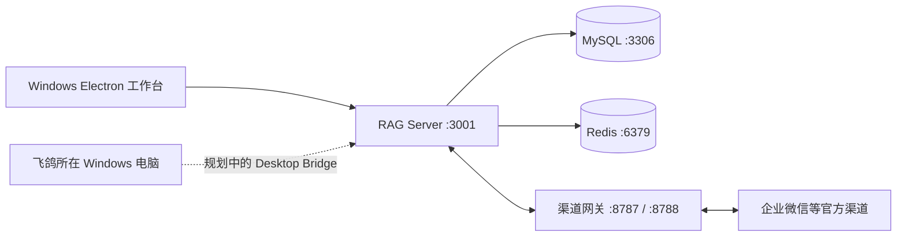

# 孤勇者本地客服 ERP

一个面向 Windows 桌面端的本地优先客服与电商运营工作台。项目希望把多个平台的会话、客户、商品、报价、订单、库存、履约和 AI 辅助集中到同一套本地系统中，并尽量让业务数据保留在商家自己的电脑或内网。

公开仓库：[565395931/guyong-platform](https://github.com/565395931/guyong-platform)

> [!IMPORTANT]
> 当前版本用于内部开发和联调，不是已经完成商业交付的正式版本。真实平台授权、消息收发、公网回调、物流闭环及生产环境安全仍需逐项验证。

## 当前版本

| 模块 | 当前版本 | 作用 | 状态 |
| --- | --- | --- | --- |
| `Rag/platform-web` | 1.0.1 | Vue 3 + Electron 桌面工作台 | 主界面，持续开发 |
| `Rag/rag-server` | 1.0.0 | 本地业务、RAG 与实时消息后端 | 主后端，持续开发 |
| `wehook` | 0.1.0 | 公有渠道网关与云端控制平面 | 第一阶段 |
| Desktop Bridge | 未发布 | 连接飞鸽等没有开放接口的 Windows 客服客户端 | 基础协议已写，尚未形成可用采集端 |

当前只验收 Windows 桌面端，不承诺移动端适配。

## 已有能力

- 单机唯一管理员初始化、登录和本机密码恢复。
- 多平台会话工作台及客户资料、跟进状态管理。
- 商品目录、SKU、报价单、订单、售后事件、仓库和库存能力。
- RAG 知识库、模型配置、回复建议及人工复核流程。
- WebSocket、Socket.IO 与渠道网关的消息基础设施。
- Electron 桌面打包和本地一键启动编排。
- 企业微信等正式渠道适配器，以及租户、设备、额度和审计的云端控制平面雏形。

## 关于飞鸽聊天记录

仓库里已经有 Desktop Bridge 的协议、数据库表、仓储、租约和网关代码，也有前端对“需要桌面桥接的平台”的识别；目前包含抖音、拼多多、淘宝、1688、小红书、微信小店和快手。

但在这个版本中：

- 后端主入口还没有初始化 Desktop Bridge；
- 飞鸽 Windows 节点、窗口识别和消息读取适配器还没有完成；
- 入站消息落库、出站指令路由及运营界面还没有闭环；
- 因此，界面里出现“抖音/飞鸽”入口，不代表现在已经能取得真实聊天记录。

下一步建议先在安装飞鸽的 Windows 电脑上做一个**只读探针**：只识别窗口并读取少量测试会话，不自动点击、不自动发送。确认飞鸽界面结构稳定后，再接入本地后端和人工确认发送。

## 系统结构



主启动链路只包含以下三个应用：

| 边界 | 目录 | 说明 |
| --- | --- | --- |
| 主系统 | `Rag/rag-server` | 本地核心后端 |
| 主系统 | `Rag/platform-web` | 统一 Web / Electron 工作台 |
| 主系统 | `wehook` | 渠道网关与独立云控制平面 |
| 独立应用 | `web` | 公司官网，不进入客服 ERP 启动链路 |
| 暂停维护 | `Rag/rag-admin`、`Rag/rag-chat-ui` | 旧管理端和旧聊天界面 |
| 实验项目 | `Rag/commerce-core-poc`、`Rag/medusa-poc` | 不作为生产实现 |

更完整的边界说明见 [`SYSTEMS.md`](SYSTEMS.md)。

## 目录速览

```text
.
├─ Rag/
│  ├─ platform-web/              # Vue 3 / Electron 工作台
│  ├─ rag-server/                # Express 本地后端
│  ├─ shared-protocol/commerce/  # 共享业务协议
│  └─ commerce-projection-ledger/# 商务投影与账本
├─ wehook/                       # 渠道网关和云控制平面
├─ ops/                          # Windows 启动、状态及基础设施脚本
├─ web/                          # 独立官网
├─ start-all.bat                 # 主系统一键启动
└─ reset-admin-password.bat      # 本机管理员密码恢复
```

## 在另一台 Windows 电脑运行

### 1. 准备环境

- Windows 10/11 x64
- Git
- Node.js 24（当前开发机验证版本为 24.14.1）
- Docker Desktop（用于本地 MySQL 和 Redis）
- npm；`wehook` 如需单独安装则使用 Corepack / pnpm

### 2. 克隆代码

```powershell
git clone https://github.com/565395931/guyong-platform.git
Set-Location guyong-platform
```

### 3. 安装依赖

首次运行 `start-all.bat` 时，如果没有 `node_modules`，启动器会自动安装三个主模块的依赖。也可以提前手动执行：

```powershell
Set-Location Rag\rag-server
npm.cmd ci

Set-Location ..\platform-web
npm.cmd ci

Set-Location ..\..\wehook
corepack enable
pnpm install --frozen-lockfile

Set-Location ..
```

### 4. 配置本地环境

首次运行 `start-all.bat` 时，启动器会自动从示例创建 `Rag\rag-server\.env`，并在本机生成随机数据库密码、JWT 密钥、渠道凭据加密密钥和网关认证 Token，不会把它们提交到 GitHub。

也可以在启动前手动创建配置：

```powershell
Copy-Item Rag\rag-server\.env.example Rag\rag-server\.env
Copy-Item wehook\.env.example wehook\.env
```

模型和正式渠道仍需填写你自己的账号配置。`.env`、密钥、Token、客户数据、上传附件、数据库数据和运行日志都不会提交到 GitHub。

不要直接把生产密钥放进公开仓库。迁移到另一台电脑时，优先重新生成本机密码和密钥；必须复用的渠道凭据请通过加密压缩包、密码管理器或其他独立安全通道传输。

### 5. 准备 MySQL 和 Redis 镜像

公开仓库没有包含体积很大的离线 Docker 镜像。启动器会优先使用单独复制的离线镜像；找不到时会自动从 Docker Hub 下载。也可以提前执行：

```powershell
docker pull mysql:8.0
docker pull redis:7-alpine
```

如果目标电脑不能联网，需要从原电脑单独复制相应离线镜像文件；不要把它们重新提交到 GitHub。

### 6. 启动与查看状态

```powershell
.\start-all.bat

powershell -NoProfile -ExecutionPolicy Bypass -File .\ops\Get-PlatformStatus.ps1
```

默认端口：

| 服务 | 地址 |
| --- | --- |
| 工作台开发服务 | `http://127.0.0.1:3003` |
| 本地后端 | `http://127.0.0.1:3001` |
| 渠道网关 WebSocket | `ws://127.0.0.1:8787` |
| 渠道网关健康检查 | `http://127.0.0.1:8788/healthz` |
| MySQL | `127.0.0.1:3306` |
| Redis | `127.0.0.1:6379` |

更详细的启动说明见 [`ops/README.md`](ops/README.md)，桌面打包说明见 [`Rag/platform-web/README.desktop.md`](Rag/platform-web/README.desktop.md)。

## 验证

当前代码基线：后端 536 项、前端 148 项、网关 50 项。测试数量会随开发变化，以实际输出为准。

```powershell
Set-Location Rag\rag-server
npm.cmd test

Set-Location ..\platform-web
npm.cmd test
npm.cmd run build

Set-Location ..\..\wehook
npm.cmd test
```

单元测试通过不等于正式渠道授权、真实消息发送、OAuth、公网回调或生产数据库已经验证。

## 敏感信息和本地数据

以下内容只保留在本机，默认不会进入 Git：

- `.env`、`.env.*` 中的真实环境配置；
- API Key、OAuth Token、渠道 Secret、数据库密码和私钥；
- MySQL / Redis 数据、客户附件、PDF、日志、缓存及临时文件；
- Docker 离线镜像、安装包和本地运行时；
- `LOCAL_MIGRATION_CHECKLIST.md` 本地迁移清单。

提交前仍应检查 `git status` 和差异内容。公开可见不代表任何凭据适合上传。

## 近期路线

1. 在飞鸽电脑完成只读 UI Automation 探针和稳定性验证。
2. 把 Desktop Bridge 初始化接入后端主入口，完成节点注册、心跳和租约。
3. 完成飞鸽入站消息落库、去重、会话映射和本地工作台展示。
4. 在人工确认模式下实现回复发送，再评估受控自动化。
5. 对有正式 API 的平台，继续优先采用官方接口。

## 项目文档

- [`AGENTS.md`](AGENTS.md)：协作规则、验证基线和最新变更记录
- [`SYSTEMS.md`](SYSTEMS.md)：主系统边界
- [`Rag/docs/project-source-handoff.md`](Rag/docs/project-source-handoff.md)：源码交接说明
- [`Rag/docs/commercialization/README.md`](Rag/docs/commercialization/README.md)：商业化与部署边界

## 许可证

当前仓库尚未提供开源许可证。仓库公开仅表示代码可被查看，不代表默认授权复制、分发或商业使用。如需对外开源，请先选择并添加合适的许可证。
