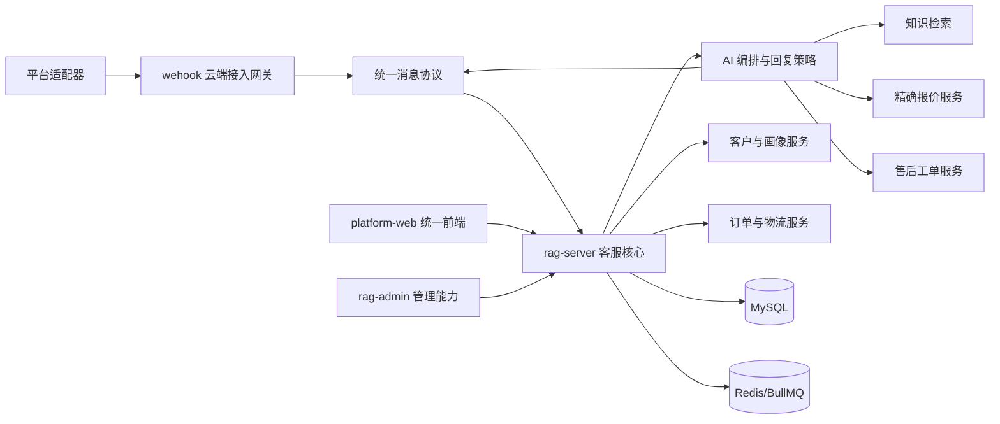

# 多平台 AI 客服系统设计

日期：2026-07-24

## 1. 目标

在现有 `Rag`、`wehook` 和 WhatsApp 能力上扩展统一的多平台 AI 客服系统。客服人员可从多台电脑登录同一个 Web 前端，查看不同平台的客户与会话，由 AI 自动回复，人工可随时接管；产品报价必须来自正式数据库；售后统一进入人工处理的工单；系统持续维护跨平台客户画像。

本设计不推倒重做现有项目。保留已经可用的 WhatsApp、统一会话、AI/RAG、人工接管、订单、发票和基础统计能力，替换统一前端中的模拟数据，并补齐缺失业务模块。

## 2. 已确认的决策

- 采用现有阿里云网关方案：平台回调或消息同步进入 `wehook`，标准化后交给 `rag-server`。
- MySQL 是产品、价格、运费、知识、客户、订单和工单的唯一正式数据源。
- Markdown、Excel、Word 和 PDF 用于导入、导出、原始资料留存及备份，不作为运行时价格真相源。
- AI 默认可自动回复，人工可以随时接管。
- 报价必须实时调用结构化报价服务；不得从模型记忆、聊天历史或普通知识文档猜测价格。
- 售后由 AI 识别并收集信息，自动创建工单；退款、退货、补发、赔偿和最终金额由人工决定。
- 当前企业微信“客服1号”保持不变。企业微信接入先使用独立测试客服账号、非公开入口和测试白名单。
- 第一阶段不一次接入全部平台；先打通真实数据基础，再接入企业微信测试账号，后续按适配器逐个平台上线。

## 3. 现有能力与缺口

### 3.1 可直接复用

- `platform-web` 的会话工作台、会话列表、实时消息和登录框架。
- `rag-server` 的会话、消息、会话池、AI 自动回复、RAG、人工认领/释放/转回 AI、订单、物流、发票、附件和统计接口。
- `rag-admin` 中真实可用的知识文档上传、删除、分块、检索和 QA 审核能力。
- `wehook` 的云端网关、标准消息协议、消息存储、ACK、重试和重放框架。
- WhatsApp WAHA 适配器。

### 3.2 需要改造或新增

- `platform-web` 的平台账号、客服管理和部分知识库页面目前使用模拟数据，需要改接真实接口。
- 新增产品、SKU、价格规则、运费规则、发布版本和审计记录。
- 新增售后工单、工单事件、工单附件和负责人流转。
- 扩展客户表，支持平台身份、标签、画像、意向、报价历史和跟进任务。
- 新增企业微信“微信客服”适配器；现有代码只有微信渠道占位，没有实际消息适配器。
- 扩展统计为平台、产品、报价、成交、售后原因和客户生命周期分析。

## 4. 总体架构

各单元职责明确：

- `wehook` 只负责平台鉴权、回调、消息同步、标准化、可靠传输和发送，不承担 AI 与业务管理。
- `rag-server` 负责统一会话、权限、AI 编排、报价、知识、客户、订单、工单和统计。
- `platform-web` 是客服与业务人员的统一入口。
- `rag-admin` 中成熟的真实功能逐步合并到统一前端；合并完成前可作为管理后台继续使用。

## 5. 前端信息架构

统一前端包含以下栏目：

1. **统一会话**：按平台、账号、会话池、负责人、状态和关键词筛选所有客户消息。
2. **客服工作台**：AI 自动回复、人工回复、接管、释放、转回 AI、快捷回复和上下文查看。
3. **产品与报价**：维护产品、SKU、规格、包装、币种、阶梯价、最低订购量、运费规则和有效期。
4. **知识中心**：维护 FAQ、产品资料、施工说明、售后规则和附件；支持导入、预览、草稿、发布和历史版本。
5. **售后工单**：查看来源平台、客户、订单、产品、金额、原因、证据、负责人、状态和处理结果。
6. **客户中心**：展示跨平台身份、聊天记录、需求、意向产品、预算、标签、报价历史、订单和跟进任务。
7. **数据分析**：分析平台询盘、AI解决率、人工响应、产品咨询、报价转化、成交、售后原因和客服绩效。
8. **系统管理**：管理平台账号、客服人员、角色权限、AI策略、发布审批、操作日志和安全配置。

## 6. 正式数据模型

### 6.1 产品与报价

- `products`：产品主数据、名称、说明、状态和默认知识范围。
- `product_skus`：型号、规格、包装、重量、覆盖面积和可销售状态。
- `price_rules`：SKU、客户类型、数量起止、币种、单价、生效时间、失效时间和发布版本。
- `freight_rules`：国家/区域、首重、续重、DDU/DDP、币种、有效期和需人工确认标记。
- `quote_records`：客户、平台、会话、输入条件、命中规则、报价快照、版本和发送消息。
- `catalog_versions`：草稿、已发布、已停用、创建人、发布人和发布时间。

AI 查询报价时必须提供产品或 SKU、数量、币种、目的国家和必要的客户类型。条件不足时先向客户追问；查不到有效规则时转人工，不生成推测价格。

### 6.2 知识资料

- `knowledge_articles`：结构化 FAQ、产品说明、施工说明和售后规则。
- `knowledge_revisions`：内容版本、状态、修改人和发布时间。
- `knowledge_document_sources`：继续保留原始文件、文件哈希、导入记录和知识范围。
- `knowledge_publish_jobs`：将已发布内容同步到百炼索引的任务、版本和结果。

现有 8 个 Markdown 文件先按哈希去重；5 个完全相同的价格文件只生成一个候选数据版本。`7.13关键词.xlsx` 作为营销关键词资料留存，不导入价格库。所有导入先预览、人工确认，再发布。

### 6.3 客户与画像

- `customer_profiles`：统一客户主档、负责人、阶段、来源、意向等级和摘要。
- `customer_identities`：平台、账号、平台客户 ID、昵称、手机号和邮箱。
- `customer_tags` 与 `customer_tag_links`：标签定义和客户关联。
- `customer_profile_facts`：AI 提取的需求、预算、场景、产品偏好、置信度和证据消息。
- `customer_followups`：跟进时间、负责人、内容、状态和提醒。

AI 可以提出或更新画像事实，但必须保留来源消息、置信度和修改历史；人工填写的字段优先，AI 不得静默覆盖。

### 6.4 售后工单

- `after_sales_tickets`：工单号、来源平台、客户、订单、产品、数量、申请金额、原因、优先级、负责人和状态。
- `after_sales_events`：创建、补充材料、分配、审核、处理、退款/补发决定和关闭时间线。
- `after_sales_attachments`：图片、视频、文件、平台消息 ID 和存储位置。

状态固定为：待补充资料、待分配、处理中、待客户确认、已解决、已关闭、已驳回。AI 只负责识别、安抚、收集和建单，不批准退款或赔偿。

## 7. 消息与 AI 数据流

1. 平台适配器收到客户消息，生成平台消息唯一键。
2. `wehook` 完成验签、解密、去重和标准化，并可靠发送给 `rag-server`。
3. `rag-server` 根据平台、账号和外部客户 ID 查找或创建客户身份与会话。
4. 若会话已被人工接管，消息进入人工工作台，不启动自动回复任务。
5. 若处于 AI 模式，AI 先进行意图路由：普通知识、报价、订单物流、售后或人工请求。
6. 普通知识调用 RAG；报价调用精确报价服务；订单物流调用订单服务；售后创建或更新工单。
7. 回复通过消息队列发送到 `wehook`，再由原平台适配器发送。
8. 所有输入、工具调用、命中版本、回复、失败和人工操作写入审计日志。

人工接管操作必须原子地把会话从 AI 池移入人工池，并取消尚未发送的 AI 任务。已经进入平台发送阶段的消息以幂等发送结果为准，前端显示状态，避免重复回复。

## 8. 异常处理与安全

- 所有入站和出站消息使用平台消息 ID 或内部幂等键去重。
- 网关、AI、索引和平台发送使用队列重试；超过次数进入失败队列，可在后台重放。
- 报价条件不完整、无有效价格、价格过期或货运规则要求确认时，AI 明确说明需要补充或人工确认。
- 知识发布采用版本号；只有成功建立索引的已发布版本可被 AI 使用，失败时继续使用上一版本。
- 工单创建失败时不向客户承诺“已建单”，系统重试并通知人工。
- 平台密钥、企业微信 Secret、数据库密码和 AI 密钥只存环境变量或密钥管理服务，不写入代码或前端。
- 更换现有代码中的默认明文密钥和已经暴露的账号密码；启用最小权限、MFA、加密存储和操作审计。
- 客户联系方式、地址和聊天记录按角色授权；日志对敏感字段脱敏。

## 9. 企业微信隔离接入

- 不修改现有“客服1号”的接待人员、欢迎语、机器人、在线状态或公开入口。
- 新建独立的“AI测试客服”账号和企业内部自建应用，仅授权测试账号。
- 测试入口不公开，只给测试微信或内部人员使用。
- 第一阶段验证 URL、消息同步、收发、图片/文件、去重、超时、人工接管和审计。
- 通过验收后，再由管理员明确选择是否把正式客服账号纳入 API 管理；不得自动扩大授权范围。

## 10. 测试与验收

### 10.1 自动化测试

- 单元测试：价格命中、阶梯价、运费、有效期、工单状态机、身份匹配和权限。
- 数据库测试：迁移可重复执行、唯一键、回滚、版本发布和审计记录。
- 适配器契约测试：统一消息格式、验签、去重、媒体和错误映射。
- 集成测试：客户消息到 AI 回复、报价工具调用、售后建单和人工接管。
- 消息重放测试：重复回调、乱序消息、网关重连和平台发送超时。
- 前端测试：真实接口、权限、草稿发布、表单校验和多客服并发操作。

### 10.2 试运行验收

- 现有 WhatsApp 会话和“客服1号”不受影响。
- 同一条平台消息只生成一条系统消息和一条回复任务。
- AI 报价能追溯到具体 SKU、价格规则和发布版本。
- 无有效价格时不会生成价格数字。
- 售后对话能生成完整工单，人工可分配、处理和关闭。
- 人工接管后 AI 不再继续发送。
- 多台电脑登录后能看到一致的实时会话和业务状态。

## 11. 分阶段实施

### 阶段一：真实数据基础与前端接通

- 建立产品、SKU、价格、运费、发布版本和审计表。
- 导入现有知识与价格文件并去重，提供预览和发布。
- 把统一前端中的知识库、平台账号和客服管理模拟数据替换为真实接口。
- 实现精确报价服务及 AI 工具接口，但暂不对正式微信客服开放。

### 阶段二：企业微信隔离测试接入

- 在 `wehook` 增加微信客服适配器。
- 创建并授权独立 AI 测试客服账号。
- 完成消息收发、媒体、去重、队列和人工接管联调。

### 阶段三：售后工单与客户画像

- 建立工单、时间线、附件、分配和统计。
- 扩展客户身份、标签、画像事实和跟进任务。
- AI 自动识别售后并建单，异步更新可审核画像。

### 阶段四：统一前端与运营分析完善

- 合并 `rag-admin` 的真实知识和系统管理能力。
- 完成平台、产品、报价、成交、售后和客户生命周期分析。
- 补齐角色权限、发布审批和运维界面。

### 阶段五：其他平台适配器

- 根据官方 API 可用性和授权条件，依次接入表格中的其他平台。
- 每个平台独立通过契约测试和小范围试运行后再上线。

## 12. 非目标

- 第一阶段不一次接入表格中的全部平台。
- AI 不自动批准退款、退货、补发、赔偿或修改订单金额。
- 不允许通过前端直接改服务器 Markdown 文件作为正式发布方式。
- 不在未经确认的情况下接管或修改现有企业微信“客服1号”。
- 不为验证码滥用、账号绕过或未获授权的平台访问提供能力。

