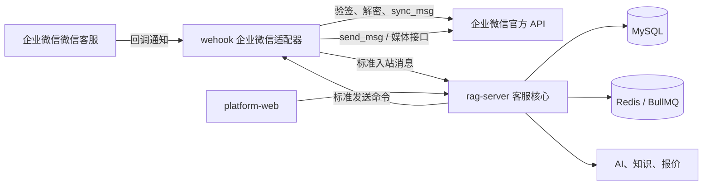

# 企业微信多主体、多客服账号 AI 客服设计

**日期：** 2026-07-24  
**状态：** 待用户书面审核  
**范围：** 企业微信“微信客服”官方接口，不包含抖店、淘宝、拼多多等其他平台

## 1. 目标

在现有 `wehook`、`rag-server` 和 `platform-web` 基础上，先完成企业微信的真实接入闭环：

- 支持多个企业微信主体。
- 支持每个主体下多个微信客服账号。
- 客服从统一收件箱查看全部账号的客户消息。
- 每条会话明确归属企业主体和微信客服账号，账号之间不能串消息。
- AI 可按账号独立启用，人工可随时接管。
- 现有“客服1号”在测试阶段保持保护模式，不改变其正常工作状态。

本阶段完成后，再使用同一适配器边界扩展其他平台；本设计不安排其他平台的开发顺序。

## 2. 已确认决策

1. 只做企业微信，不同时开发其他平台。
2. 同时支持多个企业主体，以及每个主体下多个微信客服账号。
3. 采用“企业连接”和“客服账号”两级模型。
4. 客服工作台采用全账号统一收件箱，而不是先进入某个账号工作区。
5. 使用企业微信“微信客服”官方 API，不使用远程控制、网页自动化或个人微信协议。
6. 第一批只启用独立的“AI测试客服”和测试白名单。
7. “客服1号”默认保护：不自动回复、不改变接待人员、欢迎语或在线状态。

## 3. 现有代码基础与缺口

### 3.1 可复用能力

- `rag-server` 已有 `channel_definitions`、`channel_accounts` 和 `seat_account_bindings`。
- 会话、消息和客户相关表已携带 `channel` 与 `account_id`。
- 会话池已支持 AI、人工接管、释放和转回 AI。
- `channel-adapters` 已定义统一适配器边界，并实现 WhatsApp WAHA 适配器。
- `wehook` 已具备标准协议、消息存储、命令、ACK、重试和重放基础。
- `platform-web` 已有会话工作台，可改造为统一收件箱。

### 3.2 当前缺口

- `platform-web/src/views/Settings/AccountManage.vue` 仍使用模拟账号数据，且未进入主路由。
- 当前 `channel_accounts` 把企业级凭据和账号级信息混在一个配置中，不适合一个企业下多个 `open_kfid`。
- 企业微信与抖音在适配器注册表中仍是占位，只有 WhatsApp 可实际收发。
- 缺少企业微信回调验签、解密、消息同步、媒体和发送实现。
- 缺少账号保护模式、测试白名单、连接健康状态和操作审计。

## 4. 总体架构

职责边界：

- `wehook`：平台回调、验签、解密、令牌、消息同步、媒体、标准化、发送和可靠传输。
- `rag-server`：连接和账号管理、统一会话、权限、AI/人工状态、知识、报价、客户和审计。
- `platform-web`：统一收件箱、企业连接、客服账号、白名单、坐席和状态监控。

企业连接的管理记录以 `rag-server` 的 MySQL 为准。连接验证或密钥替换后，`rag-server` 通过现有已鉴权云网关链路向 `wehook` 下发带版本号的运行配置快照；`wehook` 只保存处理回调所需的加密运行副本，并拒绝旧版本覆盖。停用连接时下发停用版本。两个服务分别使用环境变量中的密钥管理配置解密，任何明文凭据都不进入消息协议、日志或前端。

## 5. 企业连接与客服账号模型

### 5.1 企业连接

新增 `platform_connections`，一行代表一个企业微信主体的“微信客服”接入：

- `id`
- `channel_code`，固定为 `wecom_kf`
- `connection_name`
- `corp_id`
- `credential_ciphertext`，加密保存微信客服 Secret
- `callback_token_ciphertext`
- `encoding_aes_key_ciphertext`
- `callback_key`，生成不可预测的回调路径标识
- `status`：`draft`、`verified`、`active`、`disabled`、`error`
- `health_status` 与 `health_message`
- `last_token_refresh_at`
- `last_callback_at`
- `last_sync_at`
- `created_by`、`updated_by`、时间戳

`corp_id` 和所有密钥不得返回前端原文；列表只显示脱敏标识。相同企业主体不得重复创建活动连接。

### 5.2 微信客服账号

扩展现有 `channel_accounts`：

- `connection_id`，关联企业连接
- `external_account_id`，保存企业微信 `open_kfid`
- `account_name` 与头像
- `protection_level`：`locked`、`test`、`none`
- `ai_enabled`
- `allowlist_enabled`
- `sync_status`
- `last_inbound_at`、`last_outbound_at`

唯一键为 `(connection_id, external_account_id)`。账号由企业微信官方账号列表同步，不要求管理员重复填写 CorpID、Secret、Token 或 EncodingAESKey。

`locked` 表示生产基线账号，普通管理接口不能解除保护；“客服1号”固定使用该等级。`test` 表示测试账号，只允许白名单内收发；“AI测试客服”使用该等级。`none` 预留给以后单独验收通过的正式账号，本阶段不使用。

### 5.3 白名单、同步状态和审计

新增：

- `channel_account_allowlists`：账号、外部联系人 ID、说明、状态和创建人。
- `channel_sync_states`：连接、同步游标、最近成功时间、错误和重试次数。
- `channel_operation_logs`：连接验证、账号同步、保护模式、AI 开关、白名单、坐席和发送操作。

继续复用 `seat_account_bindings`，将系统客服人员绑定到一个或多个微信客服账号。

## 6. 前端信息架构

### 6.1 统一会话

以现有会话工作台为基础，默认显示所有已授权账号的客户消息：

- 左侧筛选：企业主体、客服账号、AI/人工、会话状态、负责人、未读和关键词。
- 会话行：客户名称、企业主体、客服账号、最后消息、未读、AI/人工状态和负责人。
- 中间聊天区：消息、媒体、发送状态、AI 建议、人工回复、接管和释放。
- 右侧客户区：客户画像、来源账号、意向、历史报价、订单和跟进任务。

账号只是筛选条件和消息归属标识，客服不需要先进入某个账号才能看到新消息。

### 6.2 平台账号

主导航新增“平台账号”，采用密集表格和详情抽屉，不使用模拟卡片：

1. **企业连接**：主体名称、脱敏 CorpID、状态、账号数、最近回调、最近同步和错误。
2. **客服账号**：所属企业、名称、`open_kfid` 脱敏值、保护模式、AI、白名单、坐席和最近收发。
3. **坐席分配**：按客服账号分配主管和客服人员。
4. **操作日志**：记录谁在何时修改了连接、保护、AI、白名单和坐席。

新增连接使用分步抽屉：填写企业凭据、验证、配置回调、同步账号、选择测试账号、建立白名单。密钥字段保存后只能替换，不能查看。

## 7. 企业微信消息流程

### 7.1 入站

1. 企业微信向 `/webhooks/wecom/:callbackKey` 发送验证请求或加密回调。
2. `wehook` 根据 `callbackKey` 找到企业连接，完成签名校验与解密。
3. 回调只作为消息同步通知；网关使用官方消息同步接口拉取完整消息和事件。
4. 网关按官方消息 ID 去重，转换为现有标准消息协议。
5. 标准消息包含 `channel=wecom_kf`、`connectionId`、`accountId`、`openKfId`、`externalUserId`、消息类型、内容、媒体和时间。
6. `rag-server` 以 `(channel, account_id, external_user_id)` 查找或创建客户身份与会话。
7. 保护和 AI 策略通过后进入 AI 队列，否则只进入人工工作台。

### 7.2 出站

1. 人工回复或 AI 任务生成标准发送命令。
2. `rag-server` 再次检查账号状态、保护模式、白名单和会话接管状态。
3. `wehook` 调用企业微信发送接口，并记录平台消息 ID。
4. 结果通过 ACK 返回，前端显示发送中、成功、失败或待重试。

图片、视频和文件先经过平台媒体接口上传或下载，再以内部附件记录关联原始消息。

## 8. AI 与人工发送闸门

AI 发送必须同时满足：

- 企业连接为 `active`。
- 客服账号为活动状态。
- `protection_level` 不是 `locked`。
- `protection_level=test` 时客户命中账号白名单。
- `ai_enabled=true`。
- 会话当前属于 AI 模式。
- 没有更新的人工接管版本或待取消任务。

任一条件不满足，AI 只能生成内部建议，不能调用平台发送。人工接管采用数据库事务更新会话版本，并取消尚未进入平台发送阶段的 AI 任务。

“客服1号”在本阶段固定为 `locked`，前端和本阶段管理 API 都不能改为其他等级。以后如需正式启用，应另行设计带二次确认、审批和审计的上线流程。

## 9. 启用顺序

1. 创建企业连接并只验证凭据，不发送消息。
2. 配置官方回调并验证连接健康。
3. 同步全部微信客服账号；新同步账号默认保护、AI 关闭。
4. 选择独立“AI测试客服”，设置白名单。
5. 验证入站文本、图片、文件、重复回调和乱序消息。
6. 启用人工测试发送。
7. 启用白名单内 AI 自动回复，验证人工接管。
8. 测试通过后仍不自动扩大到“客服1号”或其他账号。

## 10. 异常与可靠性

- 回调必须快速应答；耗时的同步、媒体和 AI 操作进入队列。
- 访问令牌缓存并在单进程锁下刷新，避免并发刷新冲突。
- 同步游标只在完整批次成功后推进；失败从上一成功游标重试。
- 入站消息、出站命令和平台发送结果都有幂等键。
- 发送失败按可重试和不可重试分类；超过次数进入失败队列并通知管理员。
- 授权失效、回调失败和同步停滞在账号管理页显示红色状态，但不得影响其他企业连接。
- 日志对 Secret、Token、AESKey、客户联系方式和消息内容按权限脱敏。
- Redis 不可用时停止 AI 自动发送，保留回调事件并报警；MySQL 不可用时网关持久化待转发事件，恢复后重放。

## 11. API 边界

`rag-server` 管理接口：

- `GET/POST /api/v1/platform-connections`
- `GET/PATCH /api/v1/platform-connections/:id`
- `POST /api/v1/platform-connections/:id/verify`
- `POST /api/v1/platform-connections/:id/sync-accounts`
- `GET /api/v1/channel-accounts`
- `PATCH /api/v1/channel-accounts/:id/policy`
- `GET/POST/DELETE /api/v1/channel-accounts/:id/allowlist`
- `GET/PUT /api/v1/channel-accounts/:id/seats`
- `GET /api/v1/channel-operation-logs`

`wehook` 外部与内部接口：

- `GET/POST /webhooks/wecom/:callbackKey`
- 企业连接运行配置通过现有已鉴权云网关链路下发，包含连接 ID、配置版本、加密运行配置和启停状态。
- 标准入站事件投递接口沿用现有云网关协议。
- 标准出站命令与 ACK 沿用现有命令协议。

## 12. 权限

- `admin`：企业连接、密钥替换、回调、账号同步和保护策略。
- `supervisor`：账号 AI、白名单、知识范围和坐席分配；不能读取密钥。
- `agent`：查看被授权账号的会话、人工回复、接管和释放。

所有查询在服务端按角色和 `seat_account_bindings` 限制，不能只依赖前端隐藏按钮。

## 13. 测试与验收

### 13.1 自动化测试

- 多企业、多账号同步和唯一键。
- 回调验证、解密、重复消息、乱序和游标恢复。
- 文本、图片、视频和文件标准化。
- 访问令牌刷新与并发锁。
- 账号、白名单、保护模式和人工接管发送闸门。
- 不同 `account_id` 下相同客户 ID 不串会话。
- 企业连接故障不影响其他连接。
- 管理接口权限和敏感字段脱敏。
- 统一收件箱筛选、账号标识、发送状态和接管交互。

### 13.2 试运行验收

- 系统能显示企业主体下的全部微信客服账号。
- “AI测试客服”能接收白名单客户的文本和媒体消息。
- 人工回复和 AI 回复通过原账号发送。
- 重复回调不会重复创建消息或重复回复。
- 人工接管后 AI 不再发送。
- 账号连接、最近回调、同步和失败状态在前端可见。
- “客服1号”的接待人员、欢迎语、在线状态和客户回复不被改变。

## 14. 实施分段

1. **真实账号管理**：数据表、管理 API、前端企业连接与客服账号页面，替换模拟数据。
2. **官方适配器**：回调、验签、解密、令牌、账号同步、消息同步和媒体。
3. **统一收件箱**：账号筛选、消息归属、发送状态和坐席权限。
4. **AI测试闭环**：保护模式、白名单、AI 发送闸门和人工接管。
5. **可靠性验收**：重试、失败队列、监控、审计和隔离测试。

## 15. 非目标

- 不接入个人微信。
- 不使用远程控制或浏览器自动化收发消息。
- 不开发抖店、淘宝、拼多多、1688、小红书或快手适配器。
- 不在本阶段启用“客服1号”AI 自动回复。
- 不在未经单独确认的情况下修改生产企业微信设置或发布入口。
